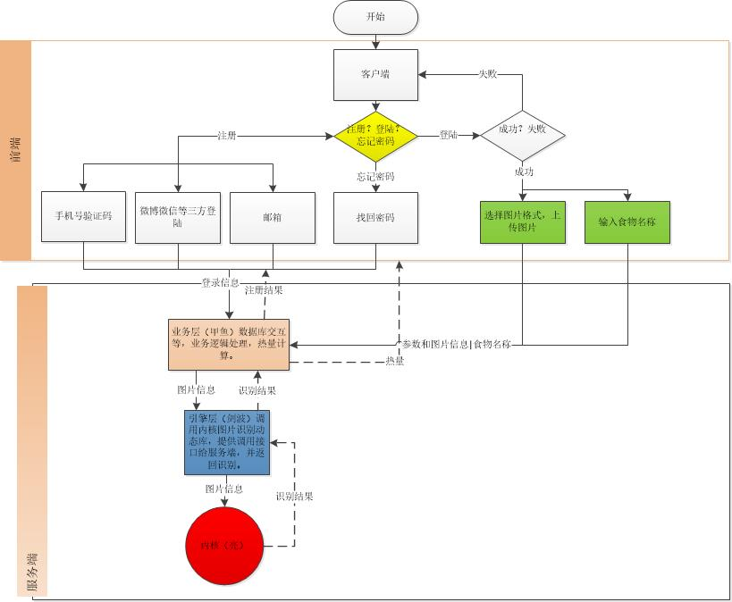

#album 说明文档

----------
##一期功能点
-  密码登录
- 用户管理
-  用户上传一张照片，可以得到照片中食物类型和每单位热量。
-  用户输入食物名称及重量，返回热量值
##二期功能点

----------

- 1. 提供食物重量参考值
- 2. 提供在线热量计算器
- 3. 一些运动，健身方面的建议（文本+动图）
- 4. 提供菜谱推荐(做菜方式，摆盘建议等)
- 5 结果可以分享到微信，qq （打卡形式，提供日期及打卡封面，积分奖励等）
- 6. 历史查询记录，自己的饮食记录。
- 6. 用户设置自己的饮食需求模式（减脂，增肌，月子餐，养病餐（不同疾病类型，骨伤，胃病，大姨妈，视力差，职业病等），下火餐），提供饮食搭配建议。
###6.业务请求调度结构图
注：.绿色为功能点
7